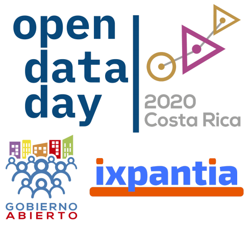

# Datatón Open Data Day Costa Rica 2020 

Este es el repositorio de trabajo para el Open Data Day Costa Rica 2020

# ¿Qué es el Datatón?

ixpantia organiza el **Datatón** que se desarrollará dentro del
marco del Open Data Day 2020 organizado por el **Gobierno
Abierto** de Costa Rica. El Open Data Day, y por tanto también el
Datatón, tendrán lugar el **sábado 7 de marzo en el CENAC**.

Si estás interesado en formar parte de esta actividad podés inscribirte [aquí](https://docs.google.com/forms/d/e/1FAIpQLSeCVIxQzYgE1Dx29KzDPe4WljpI5Y145N8HrFsmFL3fTibCwQ/viewform)

# Código de conducta

Para el evento tenemos un código de conducta. Lo podés leer todo
[acá](https://github.com/ixpantia/opendataday2020/blob/master/doc/codigo-de-conducta.md)
pero básicamente queremos procurar un ambiente donde todos compartimos lo que
hacemos y lo que sabemos sin prepotencia alguna, además de aprender a construir
en comunidad.

# Detalles del Datatón

Para más detalles del datatón hemos creado un documento en formato pdf que 
contiene más información de la actividad. Lo podés revisar [acá](https://github.com/ixpantia/opendataday2020/blob/master/doc/Brochure%20Datato%CC%81n%20v2.pdf)

